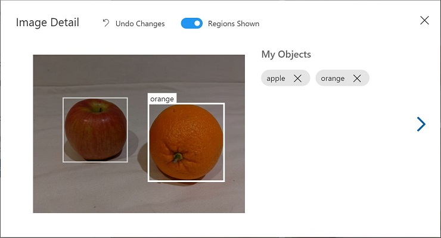

---
lab:
  title: Erkennen von Objekten in Bildern mit Azure AI Custom Vision
---

# Erkennen von Objekten in Bildern mit Azure AI Custom Vision

In dieser Übung verwenden Sie den Custom Vision-Dienst, um ein *Objekterkennungs*modell zu trainieren, das drei Klassen von Obst in einem Bild erkennen und auffinden kann (Apfel, Banane und Orange).

## Klonen des Repositorys für diesen Kurs

Wenn Sie das Coderepository **mslearn-ai-vision** bereits in die Umgebung geklont haben, in der Sie in diesem Lab arbeiten, öffnen Sie es in Visual Studio Code. Führen Sie andernfalls die folgenden Schritte aus, um es jetzt zu klonen.

1. Starten Sie Visual Studio Code.
2. Öffnen Sie die Palette (UMSCHALT+STRG+P), und führen Sie einen **Git: Clone**-Befehl aus, um das Repository `https://github.com/MicrosoftLearning/mslearn-ai-vision` in einen lokalen Ordner zu klonen (der Ordner ist beliebig).
3. Nachdem das Repository geklont wurde, öffnen Sie den Ordner in Visual Studio Code.
4. Warten Sie, während zusätzliche Dateien zur Unterstützung der C#-Codeprojekte im Repository installiert werden.

    > **Hinweis**: Wenn Sie aufgefordert werden, erforderliche Ressourcen zum Erstellen und Debuggen hinzuzufügen, wählen Sie **Jetzt nicht** aus.

## Erstellen von Custom Vision-Ressourcen

Wenn Sie in Ihrem Azure-Abonnement bereits über **Custom Vision**-Ressourcen für Training und Vorhersage verfügen, können Sie diese oder ein bestehendes Multi-Service-Konto für diese Übung verwenden. Wenn nicht, gehen Sie folgendermaßen vor, um sie zu erstellen.

> **Hinweis**: Wenn Sie ein Konto mit mehreren Diensten verwenden, sind der Schlüssel und der Endpunkt für das Training und die Vorhersage derselbe.

1. Öffnen Sie auf einer neuen Browserregisterkarte das Azure-Portal unter `https://portal.azure.com`, und melden Sie sich mit dem Microsoft-Konto an, das Ihrem Azure-Abonnement zugeordnet ist.
2. Wählen Sie die Schaltfläche **&#65291;Ressource erstellen** aus, suchen Sie nach *Custom Vision*, und erstellen Sie eine **Custom Vision**-Ressource mit den folgenden Einstellungen:
    - **Erstellungsoptionen**: Beide
    - **Abonnement:** *Geben Sie Ihr Azure-Abonnement an.*
    - **Ressourcengruppe**: *Wählen Sie eine Ressourcengruppe aus, oder erstellen Sie eine Ressourcengruppe (wenn Sie eine gehostete Lab-Umgebung verwenden, sind Sie möglicherweise nicht berechtigt, eine neue Ressourcengruppe zu erstellen, verwenden Sie dann die bereitgestellte Ressourcengruppe).*
    - **Region**: *Wählen Sie eine beliebige verfügbare Region aus*.
    - **Name**: *Geben Sie einen eindeutigen Namen ein.*
    - **Tarif für Training**: F0
    - **Tarif für Vorhersage**: F0

    > **Hinweis**: Falls Ihr Abonnement bereits einen Custom Vision-Dienst im Tarif F0 enthält, wählen Sie für diesen **S0** aus.

3. Warten Sie, bis die Ressourcen erstellt wurden, zeigen Sie dann die Bereitstellung an, und beachten Sie, dass zwei Custom Vision-Ressourcen bereitgestellt wurden, eine für das Training und eine für die Vorhersage (erkennbar am Suffix **-Prediction**). Sie können diese Ressourcen anzeigen, indem Sie zur Ressourcengruppe navigieren, in der Sie sie erstellt haben.

> **Wichtig**: Jede Ressource hat ihren eigenen *Endpunkt* und *Schlüssel*, die verwendet werden, um den Zugriff aus Ihrem Code zu verwalten. Um ein Bildklassifizierungsmodell zu trainieren, muss Ihr Code die *Trainings*ressource (mit ihrem Endpunkt und Schlüssel) verwenden, und um das trainierte Modell zum Vorhersagen von Bildklassen zu verwenden, muss Ihr Code die *Vorhersage*ressource (mit ihrem Endpunkt und Schlüssel) verwenden.

## Erstellen eines Custom Vision-Projekts

Um ein Objekterkennungsmodell zu trainieren, müssen Sie ein Custom Vision-Projekt auf der Grundlage Ihrer Trainingsressource erstellen. Dazu verwenden Sie das Custom Vision-Portal.

1. Öffnen Sie auf einer neuen Browserregisterkarte das Custom Vision-Portal unter `https://customvision.ai`, und melden Sie sich mit dem Microsoft-Konto an, das Ihrem Azure-Abonnement zugeordnet ist.
2. Erstellen Sie ein neues Projekt mit den folgenden Einstellungen:
    - **Name**: Detect Fruit (Obst erkennen)
    - **Beschreibung**: Objekterkennung für Obst.
    - **Ressource**: *Die Custom Vision-Ressource, die Sie zuvor erstellt haben*
    - **Projekttypen**: Objekterkennung.
    - **Domänen:** Allgemein
3. Warten Sie, bis das Projekt erstellt und im Browser geöffnet wurde.

## Hinzufügen und Markieren von Bildern

Um ein Objekterkennungsmodell zu trainieren, müssen Sie Bilder hochladen, die die Klassen enthalten, die das Modell identifizieren soll, und sie mit Tags versehen, um Begrenzungsrahmen für jede Objektinstanz anzugeben.

1. Zeigen Sie in Visual Studio Code die Trainingsbilder im Ordner **03-object-detection/training-images** an, in den Sie das Repository geklont haben. Dieser Ordner enthält Bilder von Obst.
2. Wählen Sie im Custom Vision-Portal in Ihrem Objekterkennungsprojekt die Option **Bilder hinzufügen** aus, und laden Sie alle Bilder aus dem extrahierten Ordner hoch.
3. Nachdem die Bilder hochgeladen wurden, wählen Sie das erste Bild aus, um es zu öffnen.
4. Halten Sie den Mauszeiger über ein beliebiges Objekt im Bild, bis ein automatisch erkannter Bereich wie in der folgenden Abbildung angezeigt wird. Wählen Sie dann das Objekt aus, und ändern Sie gegebenenfalls die Größe des Bereichs, um es zu umranden.

    

    Alternativ können Sie auch einfach einen Rahmen um das Objekt herum ziehen, um einen Bereich zu erstellen.

5. Wenn der Bereich das Objekt umgibt, fügen Sie ein neues Tag mit dem entsprechenden Objekttyp (*Apfel*, *Banane* oder *Orange*) hinzu, wie hier gezeigt:

    

6. Wählen Sie jedes andere Objekt im Bild aus und markieren Sie es, indem Sie die Größe der Bereiche ändern und bei Bedarf neue Tags hinzufügen.

    

7. Verwenden Sie den Link **>** auf der rechten Seite, um zum nächsten Bild zu wechseln und dessen Objekte zu markieren. Gehen Sie dann die gesamte Bildersammlung durch und markieren Sie jeden Apfel, jede Banane und jede Orange.

8. Wenn Sie das Tagging des letzten Bildes abgeschlossen haben, schließen Sie den Editor **Bilddetails**. Wählen Sie auf der Seite **Trainingsbilder** unter **Kategorien** die Option **Markiert**, um alle markierten Bilder anzuzeigen:


## Verwenden der Trainings-API zum Hochladen von Bildern

Sie können die Benutzeroberfläche im Custom Vision-Portal nutzen, um Ihre Bilder zu markieren, aber viele KI-Entwicklungsteams verwenden andere Tools, die Dateien generieren, die Informationen über Markierungen und Objektbereiche in Bildern enthalten. In solchen Szenarien können Sie die Custom Vision-Trainings-API verwenden, um markierte Bilder in das Projekt hochzuladen.

> **Hinweis**: In dieser Übung können Sie wahlweise die API aus dem **C#** oder **Python** SDK verwenden. Führen Sie in den folgenden Schritten die entsprechenden Aktionen für Ihre bevorzugte Sprache aus.

1. Klicken Sie auf das Symbol *Einstellungen* (&#9881;) oben rechts auf der Seite **Trainingsbilder** im Custom Vision-Portal, um die Projekteinstellungen anzuzeigen.
2. Notieren Sie unter **Allgemein** (auf der linken Seite) die **Projekt-ID**, die dieses Projekt eindeutig identifiziert.
3. Beachten Sie, dass auf der rechten Seite unter **Ressourcen** der Schlüssel und der Endpunkt angezeigt werden. Dies sind die Details für die *Trainingsressource*. (Sie können diese Informationen auch abrufen, indem Sie die Ressource im Azure-Portal anzeigen.)
4. Erweitern Sie in Visual Studio Code im Ordner **03-object-detection** je nach Ihrer bevorzugten Sprache den Ordner **C-Sharp** oder **Python**.
5. Klicken Sie mit der rechten Maustaste auf den Ordner **train-detector**, und öffnen Sie ein integriertes Terminal. Installieren Sie dann das Custom Vision-Trainingspaket, indem Sie den entsprechenden Befehl für Ihre bevorzugte Sprache ausführen:

**C#**

```
dotnet add package Microsoft.Azure.CognitiveServices.Vision.CustomVision.Training --version 2.0.0
```

**Python**

```
pip install azure-cognitiveservices-vision-customvision==3.1.1
```

6. Zeigen Sie den Inhalt des Ordners **train-detector** an, und beachten Sie, dass er eine Datei für Konfigurationseinstellungen enthält:
    - **C#** : appsettings.json
    - **Python**: .env

    Öffnen Sie die Konfigurationsdatei, und aktualisieren Sie die darin enthaltenen Konfigurationswerte so, dass der Endpunkt und Schlüssel für Ihre Custom Vision-*Trainingsressource* und die Projekt-ID für das zuvor erstellte Objekterkennungsprojekt verwendet werden. Speichern Sie die Änderungen.

7. Öffnen Sie im Ordner **train-detector** die Datei **tagged-images.json**, und untersuchen Sie den darin enthaltenen JSON-Code. Der JSON-Code definiert eine Liste von Bildern, die jeweils einen oder mehrere markierte Bereiche enthalten. Jeder markierte Bereich enthält einen Tagnamen sowie die oberen und linken Koordinaten und die Breite und Höhe des Begrenzungsfelds, das das markierte Objekt enthält.

    > **Hinweis**: Die Koordinaten und Dimensionen in dieser Datei geben relative Punkte auf dem Bild an. Ein *Höhen*wert von 0,7 gibt beispielsweise ein Feld an, dessen Höhe 70 % der Höhe des Bilds entspricht. Einige Taggingtools generieren andere Dateiformate, in denen die Koordinaten- und Dimensionswerte Pixel, Zoll oder andere Maßeinheiten darstellen.

8. Beachten Sie, dass der Ordner **train-detector** einen Unterordner enthält, in dem die Bilddateien gespeichert sind, auf die in der JSON-Datei verwiesen wird.

9. Beachten Sie, dass der Ordner **train-detector** eine Codedatei für die Clientanwendung enthält:

    - **C#** : Program.cs
    - **Python**: train-detector.py

    Öffnen Sie die Codedatei, und überprüfen Sie den darin enthaltenen Code, wobei Sie sich die folgenden Details notieren:
    - Namespaces aus dem von Ihnen installierten Paket werden importiert.
    - Die **Main**-Funktion ruft die Konfigurationseinstellungen ab und verwendet den Schlüssel und Endpunkt, um einen authentifizierten **CustomVisionTrainingClient** zu erstellen, der dann mit der Projekt-ID verwendet wird, um einen **Projekt**verweis auf Ihr Projekt zu erstellen.
    - Die **Upload_Images**-Funktion extrahiert die markierten Bereichsinformationen aus der JSON-Datei und verwendet sie, um einen Batch aus Bildern mit Bereichen zu erstellen, der dann in das Projekt hochgeladen wird.

10. Geben Sie das integrierte Terminal für den Ordner **train-detector** zurück und dann den folgenden Befehl zur Ausführung des Programms ein:
    
    **C#**
    
    ```
    dotnet run
    ```
    
    **Python**
    
    ```
    python train-detector.py
    ```
    
11. Warten Sie, bis das Programm beendet wird. Kehren Sie dann zu Ihrem Browser zurück, und zeigen Sie die Seite **Trainingsbilder** für Ihr Projekt im Custom Vision-Portal an (aktualisieren Sie ggf. den Browser).
12. Vergewissern Sie sich, dass dem Projekt einige neue markierte Bilder hinzugefügt wurden.

## Trainieren und Testen eines Modells

Nachdem Sie nun die Bilder in Ihrem Projekt markiert haben, können Sie ein Modell trainieren. Für

1. Klicken Sie im Custom Vision-Projekt auf **Train** (Trainieren), um ein Objekterkennungsmodell anhand der markierten Bilder zu trainieren. Wählen Sie die Option **Quick Training** (Schnelles Training) aus.
2. Warten Sie, bis der Vorgang abgeschlossen wurde (kann etwa zehn Minuten dauern), und überprüfen Sie die Leistungsmetriken *Genauigkeit*, *Abruf* und *mAP*. Diese Metriken messen die Vorhersagegenauigkeit des Klassifizierungsmodells und sollten jeweils den Wert „Hoch“ haben.
3. Klicken Sie oben rechts auf der Seite auf **Quick Test** (Schnelltest), geben Sie dann in das Feld **Image URL** (Bild-URL) `https://aka.ms/apple-orange` ein, und sehen Sie sich die generierte Vorhersage an. Schließen Sie dann das Fenster **Quick Test** (Schnelltest).

## Veröffentlichen des Objekterkennungsmodells

Jetzt können Sie Ihr trainiertes Modell veröffentlichen, damit es in einer Clientanwendung verwendet werden kann.

1. Klicken Sie im Custom Vision-Portal auf der Seite **Leistung** auf **&#128504; Veröffentlichen**, um das trainierte Modell mit den folgenden Einstellungen zu veröffentlichen:
    - **Modellname**: fruit-detector
    - **Vorhersageressource:** *Dies ist die zuvor erstellte **Vorhersageressource**, die mit „-Prediction“ endet (<u>nicht</u> die Trainingsressource).*
2. Klicken Sie links oben auf der Seite **Projekteinstellungen** auf das Symbol für den *Projektkatalog* (&#128065;), um zur Startseite des Custom Vision-Portals zu gelangen, auf der Ihr Projekt jetzt aufgelistet wird.
3. Klicken Sie auf der Startseite des Custom Vision-Portals oben rechts auf das Symbol *Einstellungen* (&#9881;), um die Einstellungen für Ihren Custom Vision-Dienst anzuzeigen. Suchen Sie dann unter **Ressourcen** Ihre auf „-Prediction“ endende *Vorhersageressource* (<u>nicht</u> die Trainingsressource), um ihre Werte für **Schlüssel** und **Endpunkt** zu ermitteln. (Sie können diese Informationen auch abrufen, indem Sie die Ressource im Azure-Portal anzeigen.)

## Verwenden der Bildklassifizierung aus einer Clientanwendung

Nachdem Sie nun das Bildklassifizierungsmodell veröffentlicht haben, können Sie es aus einer Clientanwendung heraus verwenden. Auch hier können Sie wieder wahlweise **C#** oder **Python** verwenden.

1. Wechseln Sie in Visual Studio Code zum Ordner **03-object-detection**, und erweitern Sie im Ordner für Ihre bevorzugte Sprache (**C-Sharp** oder **Python**) den Ordner **test-detector**.
2. Klicken Sie mit der rechten Maustaste auf den Ordner **test-detector**, und öffnen Sie ein integriertes Terminal. Geben Sie dann den folgenden SDK-spezifischen Befehl ein, um das Custom Vision-Vorhersagepaket zu installieren:

**C#**

```
dotnet add package Microsoft.Azure.CognitiveServices.Vision.CustomVision.Prediction --version 2.0.0
```

**Python**

```
pip install azure-cognitiveservices-vision-customvision==3.1.1
```

> **Hinweis**: Das Python SDK-Paket enthält sowohl Trainings- als auch Vorhersagepakete und ist möglicherweise bereits installiert.

3. Öffnen Sie die Konfigurationsdatei für Ihre Clientanwendung (*appsettings.json* für C# oder *.env* für Python), und aktualisieren Sie die darin enthaltenen Konfigurationswerte so, dass der Endpunkt und Schlüssel für Ihre Custom Vision-*Vorhersage*ressource, die Projekt-ID für das Objekterkennungsprojekt und der Name Ihres veröffentlichten Modells (dieses sollte *fruit-detector* sein) verwendet werden. Speichern Sie die Änderungen.
4. Öffnen Sie die Codedatei für Ihre Clientanwendung (*Program.cs* für C#, *test-detector.py* für Python), und überprüfen Sie den darin enthaltenen Code, wobei Sie sich die folgenden Details notieren:
    - Namespaces aus dem von Ihnen installierten Paket werden importiert.
    - Die **Main**-Funktion ruft die Konfigurationseinstellungen ab und verwendet den Schlüssel und Endpunkt zum Erstellen eines authentifizierten **CustomVisionPredictionClient**.
    - Das Vorhersageclientobjekt wird verwendet, um Objekterkennungsvorhersagen für das Bild **produce.jpg** zu erhalten, wobei die Projekt-ID und der Modellname in der Anforderung angegeben werden. Die vorhergesagten markierten Bereiche werden dann auf dem Bild gezeichnet, und das Ergebnis wird als **output.jpg** gespeichert.
5. Kehren Sie zum integrierten Terminal für den Ordner **test-detector** zurück, und geben Sie den folgenden Befehl ein, um das Programm auszuführen:

**C#**

```
dotnet run
```

**Python**

```
python test-detector.py
```

6. Zeigen Sie nach Abschluss des Programms die resultierende Datei **output.jpg** an, um die erkannten Objekte im Bild zu sehen.

## Weitere Informationen

Weitere Informationen zur Objekterkennung mit dem Custom Vision-Dienst finden Sie in der [Custom Vision Dokumentation](https://docs.microsoft.com/azure/cognitive-services/custom-vision-service/).
