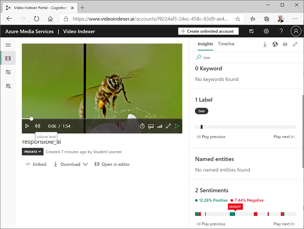

---
lab:
  title: Analysieren von Videos mit Video Indexer
  module: Module 8 - Getting Started with Azure AI Vision
---

# Analysieren von Videos mit Video Indexer

Ein großer Teil der heute erstellten und verbrauchten Daten liegt im Videoformat vor. **Azure KI Video Indexer** ist ein KI-gestützter Dienst, mit dem Sie Videos indizieren und daraus Erkenntnisse gewinnen können.

> **Hinweis**: Ab dem 21. Juni 2022 sind die Funktionen der Azure KI Services, die personenbezogene Informationen zurückgeben, auf Kunden beschränkt, denen [eingeschränkter Zugriff](https://docs.microsoft.com/azure/cognitive-services/cognitive-services-limited-access) gewährt wurde. Ohne Genehmigung für eingeschränkten Zugriff ist die Erkennung von Personen und Prominenten mit Video Indexer für dieses Lab nicht verfügbar. Weitere Informationen zu den von Microsoft vorgenommenen Änderungen und den Gründen hierfür finden Sie unter [Responsible AI investments and safeguards for facial recognition](https://azure.microsoft.com/blog/responsible-ai-investments-and-safeguards-for-facial-recognition/) (Verantwortungsvolle KI-Investitionen und Vorsichtsmaßnahmen für die Gesichtserkennung).

## Klonen des Repositorys für diesen Kurs

Wenn Sie das Coderepository **mslearn-ai-vision** kürzlich in die Umgebung geklont haben, in der Sie an diesem Lab arbeiten, öffnen Sie es in Visual Studio Code. Führen Sie andernfalls die folgenden Schritte aus, um es jetzt zu klonen.

1. Starten Sie Visual Studio Code.
2. Öffnen Sie die Palette (UMSCHALT+STRG+P), und führen Sie einen **Git: Clone**-Befehl aus, um das Repository `https://github.com/MicrosoftLearning/mslearn-ai-vision` in einen lokalen Ordner zu klonen (der Ordner ist beliebig).
3. Nachdem das Repository geklont wurde, öffnen Sie den Ordner in Visual Studio Code.
4. Warten Sie, während zusätzliche Dateien zur Unterstützung der C#-Codeprojekte im Repository installiert werden.

    > **Hinweis**: Wenn Sie aufgefordert werden, erforderliche Ressourcen zum Erstellen und Debuggen hinzuzufügen, wählen Sie **Not now** (Jetzt nicht) aus.

## Hochladen eines Videos in Video Indexer

Zunächst müssen Sie sich beim Video Indexer-Portal anmelden und ein Video hochladen.

> **Tipp**: Wenn die Video Indexer-Seite in der gehosteten Laborumgebung nur langsam geladen wird, verwenden Sie Ihren lokal installierten Browser. Für die nachfolgenden Aufgaben können Sie wieder zur gehosteten VM wechseln.

1. Öffnen Sie in Ihrem Browser das Video Indexer-Portal unter `https://www.videoindexer.ai`.
2. Wenn Sie bereits über ein Video Indexer-Konto verfügen, melden Sie sich an. Andernfalls registrieren Sie sich für ein kostenloses Konto und melden sich mit Ihrem Microsoft-Konto (oder einer anderen gültigen Kontoart) an. Wenn Sie Probleme beim Anmelden haben, versuchen Sie, eine private Browsersitzung zu öffnen.
3. Laden Sie auf einer neuen Registerkarte das Video „Verantwortungsvolle KI“ von `https://aka.ms/responsible-ai-video` herunter. Speichern Sie die Datei .
4. Wählen Sie im Video Indexer die Option **Hochladen** aus. Wählen Sie anschließend die Option **Dateien suchen** und dann das heruntergeladene Video aus. Wählen Sie **Hinzufügen** aus. Ändern Sie den Standardnamen in **Responsible AI** (Verantwortungsbewusste künstliche Intelligenz), überprüfen Sie die Standardeinstellungen, aktivieren Sie das Kontrollkästchen, um die Einhaltung der Microsoft-Richtlinien für die Gesichtserkennung zu überprüfen, und laden Sie die Datei hoch.
5. Warten Sie nach dem Hochladen der Datei einige Minuten, während Video Indexer sie automatisch indiziert.

> **Hinweis:** In dieser Übung verwenden wir dieses Video, um die Funktionalität von Video Indexer zu erkunden. Sie sollten sich jedoch die Zeit nehmen, es vollständig anzusehen, wenn Sie die Übung beendet haben, da es nützliche Informationen und Anleitungen für die verantwortungsvolle Entwicklung von KI-gestützten Anwendungen enthält! 

## Überprüfen von Erkenntnissen aus Videos

Der Indizierungsprozess extrahiert Erkenntnisse aus dem Video, das Sie im Portal ansehen können.

1. Wenn das Video indiziert ist, wählen Sie es im Video Indexer-Portal aus, um es anzuzeigen. Der Videoplayer wird neben einem Bereich angezeigt, in dem die aus dem Video extrahierten Erkenntnisse angezeigt werden.

    > **Hinweis**: Aufgrund der Richtlinie für Eingeschränkten Zugriff zum Schutz von Einzelpersonenidentitäten werden beim Indizieren des Videos möglicherweise keine Namen angezeigt.

2. Wählen Sie während der Wiedergabe des Videos die Registerkarte **Zeitachse** aus, um das Transkript der Audiodaten des Videos anzuzeigen.

3. Wählen Sie oben rechts im Portal das Symbol **Ansicht** (das ähnlich aussieht wie &#128455;) aus, und wählen Sie dann in der Liste der Erkenntnisse neben **Transkript** auch **OCR** und **Sprecher** aus.

4. Beachten Sie, dass das Fenster **Zeitachse** jetzt Folgendes enthält:
    - Transkript der Audioausgabe.
    - Im Video sichtbarer Text.
    - Angaben zu den Sprechern, die in dem Video auftreten. Einige bekannte Personen werden automatisch anhand ihres Namens erkannt, andere werden durch eine Nummer angezeigt (z. B. *Speaker #1* (Sprecher Nr. 1)).
5. Wechseln Sie zurück zum Fenster **Insights** (Erkenntnisse), und sehen Sie sich die dort gezeigten Erkenntnisse an. Dazu gehören:
    - Einzelne Personen, die in dem Video vorkommen.
    - Themen, die in dem Video besprochen werden.
    - Bezeichnungen für Objekte, die in dem Video vorkommen.
    - Benannte Entitäten, z. B. Personen und Marken, die in dem Video vorkommen.
    - Wichtige Szenen.
6. Wenn der Bereich **Insights** (Erkenntnisse) angezeigt wird, wählen Sie erneut das Symbol **Ansicht** aus, und fügen Sie in der Liste der Erkenntnisse die **Schlüsselwörter** und **Stimmungen** zu dem Bereich hinzu.

    Die gefundenen Erkenntnisse können Ihnen helfen, die Hauptthemen im Video zu bestimmen. Die **Themen** für dieses Video zeigen beispielsweise, dass es eindeutig um Technologie, soziale Verantwortung und Ethik geht.

## Suchen nach Erkenntnissen

Sie können Video Indexer verwenden, um das Video nach Erkenntnissen zu durchsuchen.

1. Geben Sie im Fenster **Insights** (Erkenntnisse) in das Feld **Suchen** den Eintrag *Bee* (Biene) ein. Möglicherweise müssen Sie im Bereich „Erkenntnisse“ nach unten scrollen, um die Ergebnisse für alle Arten von Erkenntnissen anzuzeigen.
2. Beachten Sie, dass eine übereinstimmende *Bezeichnung* gefunden wird, dessen Position im Video unten angegeben ist.
3. Wählen Sie den Anfang des Abschnitts aus, in dem eine Biene angezeigt wird, und sehen Sie sich das Video an dieser Stelle an (möglicherweise müssen Sie das Video anhalten und sorgfältig auswählen – die Biene erscheint nur kurz!)
4. Deaktivieren Sie das Feld **Suchen**, um alle Erkenntnisse für das Video anzuzeigen.

## Video Indexer-Widgets nutzen

Das Video Indexer-Portal ist eine nützliche Schnittstelle zum Verwalten von Projekten zur Videoindizierung. Es kann jedoch vorkommen, dass Sie das Video und seine Erkenntnisse auch Personen zugänglich machen möchten, die keinen Zugriff auf Ihr Video Indexer-Konto haben. Video Indexer bietet Widgets, die Sie zu diesem Zweck in eine Webseite einbetten können.

1. Öffnen Sie in Visual Studio Code im Ordner **06-video-indexer** die Datei **analyze-video.html**. Dies ist eine einfache HTML-Seite, zu der Sie die Widgets **Player** und **Insights** (Erkenntnisse) von Video Indexer hinzufügen werden. Beachten Sie den Verweis auf das Skript **vb.widgets.mediator.js** in der Kopfzeile – dieses Skript ermöglicht es mehreren Video Indexer-Widgets auf der Seite, miteinander zu interagieren.
2. Kehren Sie im Video Indexer-Portal zur Seite **Mediendateien** zurück und öffnen Sie Ihr **Verantwortungsbewusste KI**-Video.
3. Wählen Sie unter dem Videoplayer **&lt;/&gt; Embed** (Einbetten) aus, um den HTML-iframe-Code zum Einbetten der Widgets anzuzeigen.
4. Wählen Sie im Dialogfeld **Share and Embed** (Freigeben und Einbetten) das Widget **Player** aus, stellen Sie die Videogröße auf 560 x 315, und kopieren Sie dann den Einbettungscode in die Zwischenablage.
5. Fügen Sie in Visual Studio Code in der Datei **analyze-video.html** den kopierten Code unter dem Kommentar **&lt;-- Player widget goes here -- &gt;** (Player-Widget hier einfügen) ein.
6. Wählen Sie im Dialogfeld **Share and Embed** (Freigeben und Einbetten) das Widget **Insights** (Erkenntnisse), und kopieren Sie dann den Einbettungscode in die Zwischenablage. Schließen Sie dann das Dialogfeld **Share and Embed** (Freigeben und Einbetten), wechseln Sie zurück zu Visual Studio Code, und fügen Sie den kopierten Code unter dem Kommentar **&lt;-- Insights widget goes here -- &gt;** (Widget für Erkenntnisse hier einfügen) ein.
7. Speichern Sie die Datei. Klicken Sie dann im **Explorer**-Bereich mit der rechten Maustaste auf **analyze-video.html**, und wählen Sie **Reveal in File Explorer** (In Datei-Explorer anzeigen) aus.
8. Öffnen Sie in Datei-Explorer **analyze-video.html** in Ihrem Browser, um die Webseite anzuzeigen.
9. Experimentieren Sie mit den Widgets und verwenden Sie das Widget **Insights** (Erkenntnisse), um nach Erkenntnissen zu suchen und im Video zu ihnen zu springen.

## Verwenden der REST-API für den Video Indexer

Video Indexer stellt eine REST-API zur Verfügung, mit der Sie Videos in Ihr Konto hochladen und verwalten können.

### Abrufen Ihrer API-Details

Um die Video Indexer-API verwenden zu können, benötigen Sie einige Informationen zum Authentifizieren von Anforderungen:

1. Erweitern Sie im Video Indexer-Portal den linken Bereich, und wählen Sie die Seite **Kontoeinstellungen** aus.
2. Notieren Sie sich die **Konto-ID** auf dieser Seite, da Sie sie später benötigen werden.
3. Öffnen Sie eine neue Browserregisterkarte, und wechseln Sie zum Video Indexer-Entwicklerportal unter `https://api-portal.videoindexer.ai`, indem Sie sich mit den Zugangsdaten für Ihr Video Indexer-Konto anmelden.
4. Zeigen Sie auf der Seite **Profil** die **Abonnements** an, die Ihrem Profil zugeordnet sind.
5. Auf der Seite mit Ihren Abonnements sehen Sie, dass Ihnen für jedes Abonnement zwei Schlüssel (primär und sekundär) zugewiesen wurden. Wählen Sie dann **Show** (Anzeigen) für einen der Schlüssel aus, um ihn anzuzeigen. Sie werden diesen Schlüssel in Kürze benötigen.

### Verwenden der REST-API

Nachdem Sie nun über die Konto-ID und einen API-Schlüssel verfügen, können Sie die REST-API verwenden, um mit Videos in Ihrem Konto zu arbeiten. In diesem Verfahren verwenden Sie ein PowerShell-Skript, um REST-Aufrufe zu tätigen. Die gleichen Prinzipien gelten jedoch auch für HTTP-Dienstprogramme wie cURL oder Postman oder jede Programmiersprache, die JSON über HTTP senden und empfangen kann.

Alle Interaktionen mit der Video Indexer-REST-API folgen dem gleichen Muster:

- Eine erste Anforderung an die Methode **AccessToken** mit dem API-Schlüssel in der Kopfzeile wird verwendet, um ein Zugriffstoken zu erhalten.
- Nachfolgende Anforderungen verwenden das Zugriffstoken zur Authentifizierung, wenn Sie REST-Methoden zur Arbeit mit Videos aufrufen.

1. Öffnen Sie in Visual Studio Code im Ordner **06-video-indexer** die Datei **get-videos.ps1**.
2. Ersetzen Sie im PowerShell-Skript die Platzhalter **YOUR_ACCOUNT_ID** und **YOUR_API_KEY** durch die Werte für die Konto-ID und den API-Schlüssel, die Sie zuvor ermittelt haben.
3. Beachten Sie, dass der *Standort* für ein kostenloses Konto „trial“ ist. Wenn Sie ein uneingeschränktes Video Indexer-Konto (mit einer zugehörigen Azure-Ressource) erstellt haben, können Sie dies in den Standort ändern, an dem Ihre Azure-Ressource bereitgestellt wird (z. B. „eastus“).
4. Prüfen Sie den Code im Skript und stellen Sie fest, dass zwei REST-Methoden aufgerufen werden: eine zum Abrufen eines Zugriffstokens und eine weitere zum Auflisten der Videos in Ihrem Konto.
5. Speichern Sie Ihre Änderungen und verwenden Sie dann oben rechts im Skriptbereich die Schaltfläche **&#9655;** , um das Skript auszuführen.
6. Zeigen Sie die JSON-Antwort des REST-Diensts an, die Details zu dem **Responsible AI**-Video (Verantwortungsbewusste künstliche Intelligenz) enthalten sollte, das Sie zuvor indiziert haben.

## Weitere Informationen

Die Erkennung von Personen und Prominenten ist weiterhin verfügbar, aber nach dem [Standard für verantwortungsvolle KI](https://aka.ms/aah91ff) gilt hier eine Richtlinie für eingeschränkten Zugriff. Diese Features umfassen Gesichtserkennung und Prominentenerkennung. Weitere Informationen finden Sie unter [Eingeschränkter Zugriff fürAzure KI Services](https://docs.microsoft.com/azure/cognitive-services/cognitive-services-limited-access). Dort erfahren Sie auch, wie Sie den Zugriff beantragen können.

Weitere Informationen zu **Video Indexer** finden Sie in der [Video Indexer-Dokumentation](https://learn.microsoft.com/azure/azure-video-indexer/).
