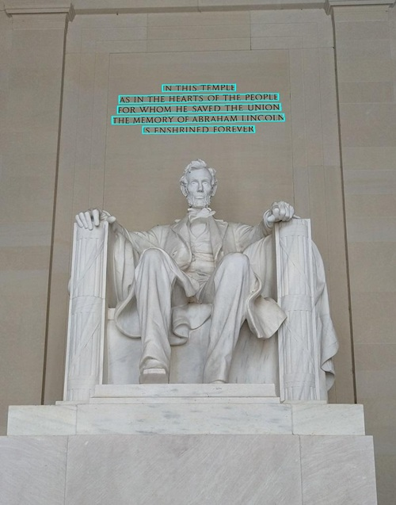

---
lab:
  title: Text in Bildern lesen
  description: 'Verwenden Sie die optische Zeichenerkennung (OCR) im Bildanalysedienst von Azure KI Vision, um Text in Bildern zu suchen und zu extrahieren.'
---

# Text in Bildern lesen

Die optische Zeichenerkennung (OCR) ist eine Teilmenge des maschinellen Sehens, die sich mit dem Lesen von Text in Bildern und Dokumenten beschäftigt. Der Bildanalysedienst von **Azure KI Vision** bietet eine API zum Lesen von Text, den Sie in dieser Übung erkunden werden.

> **Hinweis:** Diese Übung basiert auf Vorabversionen von SDK-Software, die sich möglicherweise Änderungen unterliegen. Wo nötig, haben wir spezielle Versionen von Paketen verwendet, die möglicherweise nicht die neuesten verfügbaren Versionen widerspiegeln. Es kann zu unerwartetem Verhalten, Warnungen oder Fehlern kommen.

Obwohl diese Übung auf dem Azure Vision-Analyse-Python-SDK basiert, können Sie Vision-Anwendungen mit mehreren sprachspezifischen SDKs entwickeln, einschließlich:

* [Azure KI Vision-Analyse für JavaScript](https://www.npmjs.com/package/@azure-rest/ai-vision-image-analysis)
* [Azure KI Vision-Analyse für Microsoft .NET](https://www.nuget.org/packages/Azure.AI.Vision.ImageAnalysis)
* [Azure KI Vision-Analyse für Java](https://mvnrepository.com/artifact/com.azure/azure-ai-vision-imageanalysis)

Diese Übung dauert ca. **30** Minuten.

## Bereitstellen einer Azure KI Vision-Ressource

Wenn Sie noch keine in Ihrem Abonnement haben, müssen Sie eine Azure KI Vision-Ressource bereitstellen.

> **Hinweis:** In dieser Übung verwenden Sie eine eigenständige Ressource **Maschinelles Sehen**. Sie können Azure KI Vision-Dienste auch in einer Ressource mit mehreren Diensten von *Azure KI Services* verwenden, entweder direkt oder in einem *Azure AI Foundry*-Projekt.

1. Öffnen Sie das [Azure-Portal](https://portal.azure.com) unter `https://portal.azure.com`, und melden Sie sich mit Ihren Azure-Anmeldeinformationen an. Schließen Sie alle Willkommensnachrichten oder Tipps, die angezeigt werden.
1. Wählen Sie **Ressource erstellen** aus.
1. Suchen Sie in der Suchleiste nach `Computer Vision`, wählen Sie **Maschinelles Sehen** aus, und erstellen Sie die Ressource mit den folgenden Einstellungen:
    - **Abonnement:** *Geben Sie Ihr Azure-Abonnement an.*
    - **Ressourcengruppe**: *Erstellen Sie eine Ressourcengruppe, oder wählen Sie eine Ressourcengruppe aus*.
    - **Region:** *Wählen Sie aus **USA, Osten**, **USA, Westen**, **Frankreich, Mitte**, **Südkorea, Mitte**, **Europa, Norden**, **Asien, Südosten**, **Europa, Westen** oder **Asien, Osten**\**
    - **Name**: *Ein gültiger Name für Ihre Ressource „Maschinelles Sehen“*
    - **Tarif**: Free F0

    \*Azure AI Vision 4.0 mit vollem Funktionsumfang ist derzeit nur in diesen Regionen verfügbar.

1. Aktivieren Sie die erforderlichen Kontrollkästchen, und erstellen Sie die Ressource.
1. Warten Sie, bis die Bereitstellung abgeschlossen ist, und zeigen Sie dann die Bereitstellungsdetails an.
1. Wenn die Ressource bereitgestellt wurde, wechseln Sie zu der Ressource und zeigen Sie im Navigationsbereich unter dem Knoten **Ressourcenverwaltung** die Seite **Schlüssel und Endpunkt** an. Sie benötigen den Endpunkt und einen der Schlüssel von dieser Seite im nächsten Verfahren.

## Entwickeln einer Textextraktions-App mit dem Azure KI Vision-SDK

In dieser Übung schließen Sie eine teilweise implementierte Clientanwendung ab, die das Azure KI Vision-SDK zum Extrahieren von Bildern verwendet.

### Vorbereiten der Anwendungskonfiguration

1. Verwenden Sie im Azure-Portal die Schaltfläche **[\>_]** rechts neben der Suchleiste oben auf der Seite, um eine neue Cloud Shell im Azure-Portal zu erstellen. Wählen Sie eine ***PowerShell***-Umgebung ohne Speicher in Ihrem Abonnement aus.

    Die Cloud Shell bietet eine Befehlszeilenschnittstelle in einem Fenster am unteren Rand des Azure-Portals.

    > **Hinweis**: Wenn Sie zuvor eine Cloud-Shell erstellt haben, die eine *Bash*-Umgebung verwendet, wechseln Sie zu ***PowerShell***.

    > **Hinweis:** Wenn Sie vom Portal aufgefordert werden, einen Speicher auszuwählen, um Ihre Dateien beizubehalten, wählen Sie **Kein Speicherkonto erforderlich** aus. Wählen Sie das verwendete Abonnement aus und drücken Sie auf **Anwenden**.

1. Wählen Sie in der Cloud Shell-Symbolleiste im Menü **Einstellungen** das Menüelement **Zur klassischen Version wechseln** aus (dies ist für die Verwendung des Code-Editors erforderlich).

    **<font color="red">Stellen Sie sicher, dass Sie zur klassischen Version der Cloud Shell gewechselt haben, bevor Sie fortfahren.</font>**

1. Ändern Sie die Größe des Cloud Shell-Bereichs, damit die Seite **Schlüssel und Endpunkt** für Ihre Ressource „Maschinelles Sehen“ weiterhin angezeigt wird.

    > **Tipp** Sie können die Größe des Bereichs ändern, indem Sie den oberen Rahmen ziehen. Sie können außerdem die Schaltflächen zum Minimieren und Maximieren verwenden, um zwischen Cloud Shell und der Hauptschnittstelle des Portals zu wechseln.

1. Geben Sie im Cloud Shell-Bereich die folgenden Befehle ein, um das GitHub-Repository mit den Codedateien für diese Übung zu klonen (geben Sie den Befehl ein oder kopieren Sie ihn in die Zwischenablage und klicken Sie dann mit der rechten Maustaste in die Befehlszeile, um ihn als reinen Text einzufügen):

    ```
    rm -r mslearn-ai-vision -f
    git clone https://github.com/MicrosoftLearning/mslearn-ai-vision
    ```

    > **TIPP**: Wenn Sie Befehle in die Cloudshell einfügen, kann die Ausgabe einen großen Teil des Bildschirmpuffers in Anspruch nehmen. Sie können den Bildschirm löschen, indem Sie den Befehl `cls` eingeben, um sich besser auf die einzelnen Aufgaben konzentrieren zu können.

1. Nachdem das Repository geklont wurde, verwenden Sie den folgenden Befehl, um zu den Anwendungscodedateien zu navigieren:

    ```
   cd mslearn-ai-vision/Labfiles/ocr/python/read-text
   ls -a -l
    ```

    Der Ordner enthält Anwendungskonfigurations- und Codedateien für Ihre App. Außerdem enthält er den Unterordner **/images**, der einige Bilddateien enthält, die ihre App analysieren kann.

1. Installieren Sie das Azure KI Vision-SDK-Paket und andere erforderliche Pakete, indem Sie die folgenden Befehle ausführen:

    ```
   python -m venv labenv
   ./labenv/bin/Activate.ps1
   pip install -r requirements.txt azure-ai-vision-imageanalysis==1.0.0
    ```

1. Geben Sie den folgenden Befehl ein, um die Konfigurationsdatei für Ihre App zu bearbeiten:

    ```
   code .env
    ```

    Die Datei wird in einem Code-Editor geöffnet.

1. Aktualisieren Sie in der Codedatei die Konfigurationswerte, die sie enthält, um den **Endpunkt** und einen **Authentifizierungsschlüssel** für Ihre Ressource „Maschinelles Sehen“ widerzuspiegeln (von der Seite **Schlüssel und Endpunkt** im Azure-Portal kopiert).
1. Nachdem Sie die Platzhalter ersetzt haben, verwenden Sie den Befehl **STRG+S**, um Ihre Änderungen zu speichern, und verwenden Sie dann den Befehl **STRG+Q**, um den Code-Editor zu schließen, während die Befehlszeile der Cloud Shell geöffnet bleibt.

### Hinzufügen von Code zum Lesen von Text aus einem Bild

1. Geben Sie in der Befehlszeile der Cloud Shell den folgenden Befehl ein, um die Codedatei für die Clientanwendung zu öffnen:

    ```
   code read-text.py
    ```

    > **Tipp**: Möglicherweise möchten Sie den Bereich der Cloud Shell vergrößern und die geteilte Leiste zwischen der Befehlszeilenkonsole und dem Code-Editor verschieben, damit Sie den Code einfacher anzeigen können.

1. Suchen Sie in der Codedatei den Kommentar **Import namespaces** und fügen Sie den folgenden Code hinzu, um die Namespaces zu importieren, die Sie zum Verwenden des Azure KI Vision-SDK benötigen:

    ```python
   # import namespaces
   from azure.ai.vision.imageanalysis import ImageAnalysisClient
   from azure.ai.vision.imageanalysis.models import VisualFeatures
   from azure.core.credentials import AzureKeyCredential
    ```

1. Der Code zum Laden der Konfigurationseinstellungen und zum Ermitteln der zu analysierenden Datei wurde bereits in der **Main**-Funktion bereitgestellt. Suchen Sie dann den Kommentar **Authenticate Azure AI Vision client** und fügen Sie den folgenden sprachspezifischen Code hinzu, um ein Azure KI Vision-Bildanalyse-Clientobjekt zu erstellen und zu authentifizieren:

    ```python
   # Authenticate Azure AI Vision client
   cv_client = ImageAnalysisClient(
        endpoint=ai_endpoint,
        credential=AzureKeyCredential(ai_key))
    ```

1. Suchen Sie in der **Main**-Funktion unter dem soeben hinzugefügten Code den Kommentar **Read text in image** und fügen Sie den folgenden Code hinzu, um den Text im Bild zu lesen:

    ```python
   # Read text in image
   with open(image_file, "rb") as f:
        image_data = f.read()
   print (f"\nReading text in {image_file}")

   result = cv_client.analyze(
        image_data=image_data,
        visual_features=[VisualFeatures.READ])
    ```

1. Suchen Sie den Kommentar **Print the text** und fügen Sie den folgenden Code (einschließlich des endgültigen Kommentars) hinzu, um die gefundenen Textzeilen zu drucken und eine Funktion aufzurufen, um sie im Bild zu kommentieren (mithilfe des für jede Zeile zurückgegebenen **bounding_polygon**):

    ```python
   # Print the text
   if result.read is not None:
        print("\nText:")
    
        for line in result.read.blocks[0].lines:
            print(f" {line.text}")        
        # Annotate the text in the image
        annotate_lines(image_file, result.read)

        # Find individual words in each line
        
    ```

1. Speichern Sie Ihre Änderungen (*STRG+S*), aber schließen Sie den Code-Editor nicht, falls Sie Tippfehler korrigieren müssen.

1. Ändern Sie die Größe der Bereiche, damit Sie mehr der Konsole sehen können, und geben Sie dann den folgenden Befehl ein, um das Programm auszuführen:

    ```
   python read-text.py images/Lincoln.jpg
    ```

1. Das Programm liest den Text in der angegebenen Bilddatei (*images/Lincoln.jpg*), die wie folgt aussieht:

    

1. Im Ordner **read-text** wurde das Bild **lines.jpg** erstellt. Verwenden Sie den Befehl **download** (speziell für Azure Cloud Shell), um es herunterzuladen:

    ```
   download lines.jpg
    ```

    Der Downloadbefehl erstellt unten rechts im Browser einen Popuplink, den Sie auswählen können, um die Datei herunterzuladen und zu öffnen. Das Bild sollte in etwa wie folgt aussehen:

    

1. Führen Sie das Programm erneut aus und geben Sie dieses Mal den Parameter *images/Business-card.jpg* an, um Text aus dem folgenden Bild zu extrahieren:

    

    ```
   python read-text.py images/Business-card.jpg
    ```

1. Laden Sie die resultierende Datei **lines.jpg** herunter und zeigen Sie sie an:

    ```
   download lines.jpg
    ```

1. Führen Sie das Programm ein weiteres Mal aus. Dieses Mal geben Sie den Parameter *images/Note.jpg* an, um Text aus diesem Bild zu extrahieren:

    

    ```
   python read-text.py images/Note.jpg
    ```

1. Laden Sie die resultierende Datei **lines.jpg** herunter und zeigen Sie sie an:

    ```
   download lines.jpg
    ```

### Hinzufügen von Code zum Zurückgeben der Position einzelner Wörter

1. Ändern Sie die Größe der Bereiche, damit mehr von der Codedatei angezeigt wird. Suchen Sie dann den Kommentar **Find individual words in each line** und fügen Sie den folgenden Code hinzu (achten Sie auf die richtige Einzugsebene):

    ```python
   # Find individual words in each line
   print ("\nIndividual words:")
   for line in result.read.blocks[0].lines:
        for word in line.words:
            print(f"  {word.text} (Confidence: {word.confidence:.2f}%)")
   # Annotate the words in the image
   annotate_words(image_file, result.read)
    ```

1. Speichern Sie die Änderungen (*STRG+S*). Führen Sie dann im Befehlszeilenbereich das Programm erneut aus, um Text aus *images/Lincoln.jpg* zu extrahieren.
1. Sehen Sie sich die Ausgabe an. Sie sollte jedes einzelne Wort und die mit der Vorhersage verknüpften Konfidenz in das Bild aufnehmen.
1. Im Ordner **read-text** wurde das Bild **words.jpg** erstellt. Verwenden Sie den Befehl **download** (speziell für Azure Cloud Shell), um es herunterzuladen und anzuzeigen:

    ```
   download words.jpg
    ```

1. Führen Sie das Programm für *images/Business-card.jpg* und *images/Note.jpg* erneut aus, um die für jedes Bild generierte Datei **words.jpg** anzuzeigen.

## Bereinigen von Ressourcen

Wenn Sie mit der Erkundung von Azure KI Vision fertig sind, sollten Sie die in dieser Übung erstellten Ressourcen löschen, um unnötige Azure-Kosten zu vermeiden:

1. Öffnen Sie das Azure-Portal unter `https://portal.azure.com`, und melden Sie sich mit dem Microsoft-Konto an, das Ihrem Azure-Abonnement zugeordnet ist.

1. Suchen Sie in der oberen Suchleiste nach *Maschinelles Sehen* und wählen Sie die Ressource „Maschinelles Sehen“ aus, die Sie in dieser Übung erstellt haben.

1. Wählen Sie auf der Ressourcenseite **Löschen** aus, und folgen Sie den Anweisungen zum Löschen der Ressource.
