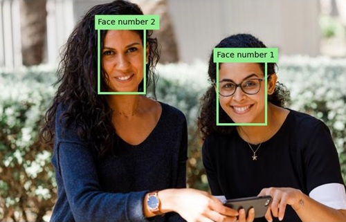

---
lab:
  title: Erkennen und Analysieren von Gesichtern
  description: 'Verwenden Sie den Azure KI Vision-Gesichtserkennungsdienst, um Gesichtserkennungs- und Analyselösungen zu implementieren.'
---

# Erkennen und Analysieren von Gesichtern

Die Fähigkeit, menschliche Gesichter zu erkennen und zu analysieren ist eine zentrale KI-Funktion. In dieser Übung erfahren Sie mehr über den **Gesichtserkennungsdienst** zum Erkennen von Gesichtern.

> **Hinweis:** Diese Übung basiert auf Vorabversionen von SDK-Software, die sich möglicherweise Änderungen unterliegen. Wo nötig, haben wir spezielle Versionen von Paketen verwendet, die möglicherweise nicht die neuesten verfügbaren Versionen widerspiegeln. Es kann zu unerwartetem Verhalten, Warnungen oder Fehlern kommen.

Obwohl diese Übung auf dem Azure Vision-Gesichtserkennungs-Python-SDK basiert, können Sie Vision-Anwendungen mit mehreren sprachspezifischen SDKs entwickeln, einschließlich:

* [Azure KI Vision-Gesichtserkennung für JavaScript](https://www.npmjs.com/package/@azure-rest/ai-vision-face)
* [Azure KI Vision-Gesichtserkennung für Microsoft .NET](https://www.nuget.org/packages/Azure.AI.Vision.Face)
* [Azure KI Vision-Gesichtserkennung für Java](https://central.sonatype.com/artifact/com.azure/azure-ai-vision-face)

Diese Übung dauert ca. **30** Minuten.

> **Hinweis:** Die Funktionen von Azure KI Services, die personenbezogene Informationen zurückgeben, sind auf Kundschaften beschränkt, denen [eingeschränkter Zugriff](https://learn.microsoft.com/legal/cognitive-services/computer-vision/limited-access-identity) gewährt wurde. Diese Übung enthält keine Gesichtserkennungsaufgaben und kann ohne zusätzlichen Zugriff auf eingeschränkte Funktionen abgeschlossen werden.

## Bereitstellen einer Azure KI-Gesichtserkennungs-API-Ressource

Wenn Sie noch keine in Ihrem Abonnement haben, müssen Sie eine Azure KI-Gesichtserkennungs-API-Ressource bereitstellen.

> **Hinweis:** In dieser Übung verwenden Sie eine eigenständige **Gesichtserkennungsressource**. Sie können Azure KI-Gesichtserkennungsdienste auch in einer Ressource mit mehreren Diensten von *Azure KI Services* verwenden, entweder direkt oder in einem *Azure AI Foundry*-Projekt.

1. Öffnen Sie das [Azure-Portal](https://portal.azure.com) unter `https://portal.azure.com`, und melden Sie sich mit Ihren Azure-Anmeldeinformationen an. Schließen Sie alle Willkommensnachrichten oder Tipps, die angezeigt werden.
1. Wählen Sie **Ressource erstellen** aus.
1. Suchen Sie in der Suchleiste nach `Face`, wählen Sie **Gesichtserkennung** aus und erstellen Sie die Ressource mit den folgenden Einstellungen:
    - **Abonnement:** *Geben Sie Ihr Azure-Abonnement an.*
    - **Ressourcengruppe**: *Erstellen Sie eine Ressourcengruppe, oder wählen Sie eine Ressourcengruppe aus*.
    - **Region**: *Wählen Sie eine beliebige verfügbare Region aus*.
    - **Name**: *Ein gültiger Name für die Gesichtserkennungsressource*
    - **Tarif**: Free F0

1. Erstellen Sie die Ressource und warten Sie, bis die Bereitstellung abgeschlossen ist. Zeigen Sie dann die Bereitstellungsdetails an.
1. Wenn die Ressource bereitgestellt wurde, wechseln Sie zu der Ressource und zeigen Sie im Navigationsbereich unter dem Knoten **Ressourcenverwaltung** die Seite **Schlüssel und Endpunkt** an. Sie benötigen den Endpunkt und einen der Schlüssel von dieser Seite im nächsten Verfahren.

## Entwickeln einer Gesichtsanalyse-App mit dem Gesichtserkennungs-SDK

In dieser Übung schließen Sie eine teilweise implementierte Clientanwendung ab, die das Azure Gesichtserkennungs-SDK zum Erkennen und Analysieren von menschlichen Gesichtern in einem Bild verwendet.

### Vorbereiten der Anwendungskonfiguration

1. Verwenden Sie im Azure-Portal die Schaltfläche **[\>_]** rechts neben der Suchleiste oben auf der Seite, um eine neue Cloud Shell im Azure-Portal zu erstellen. Wählen Sie eine ***PowerShell***-Umgebung ohne Speicher in Ihrem Abonnement aus.

    Die Cloud Shell bietet eine Befehlszeilenschnittstelle in einem Fenster am unteren Rand des Azure-Portals.

    > **Hinweis**: Wenn Sie zuvor eine Cloud-Shell erstellt haben, die eine *Bash*-Umgebung verwendet, wechseln Sie zu ***PowerShell***.

    > **Hinweis:** Wenn Sie vom Portal aufgefordert werden, einen Speicher auszuwählen, um Ihre Dateien beizubehalten, wählen Sie **Kein Speicherkonto erforderlich** aus. Wählen Sie das verwendete Abonnement aus und drücken Sie auf **Anwenden**.

1. Wählen Sie in der Cloud Shell-Symbolleiste im Menü **Einstellungen** das Menüelement **Zur klassischen Version wechseln** aus (dies ist für die Verwendung des Code-Editors erforderlich).

    **<font color="red">Stellen Sie sicher, dass Sie zur klassischen Version der Cloud Shell gewechselt haben, bevor Sie fortfahren.</font>**

1. Ändern Sie die Größe des Cloud Shell-Bereichs, damit die Seite **Schlüssel und Endpunkt** für Ihre Gesichtserkennungsressource weiterhin angezeigt wird.

    > **Tipp** Sie können die Größe des Bereichs ändern, indem Sie den oberen Rahmen ziehen. Sie können außerdem die Schaltflächen zum Minimieren und Maximieren verwenden, um zwischen Cloud Shell und der Hauptschnittstelle des Portals zu wechseln.

1. Geben Sie im Cloud Shell-Bereich die folgenden Befehle ein, um das GitHub-Repository mit den Codedateien für diese Übung zu klonen (geben Sie den Befehl ein oder kopieren Sie ihn in die Zwischenablage und klicken Sie dann mit der rechten Maustaste in die Befehlszeile, um ihn als reinen Text einzufügen):

    ```
    rm -r mslearn-ai-vision -f
    git clone https://github.com/MicrosoftLearning/mslearn-ai-vision
    ```

    > **TIPP**: Wenn Sie Befehle in die Cloudshell einfügen, kann die Ausgabe einen großen Teil des Bildschirmpuffers in Anspruch nehmen. Sie können den Bildschirm löschen, indem Sie den Befehl `cls` eingeben, um sich besser auf die einzelnen Aufgaben konzentrieren zu können.

1. Nachdem das Repository geklont wurde, verwenden Sie den folgenden Befehl, um zu den Anwendungscodedateien zu navigieren:

    ```
   cd mslearn-ai-vision/Labfiles/face/python/face-api
   ls -a -l
    ```

    Der Ordner enthält Anwendungskonfigurations- und Codedateien für Ihre App. Außerdem enthält er den Unterordner **/images**, der einige Bilddateien enthält, die ihre App analysieren kann.

1. Installieren Sie das Azure KI Vision-SDK-Paket und andere erforderliche Pakete, indem Sie die folgenden Befehle ausführen:

    ```
   python -m venv labenv
   ./labenv/bin/Activate.ps1
   pip install -r requirements.txt azure-ai-vision-face==1.0.0b2
    ```

1. Geben Sie den folgenden Befehl ein, um die Konfigurationsdatei für Ihre App zu bearbeiten:

    ```
   code .env
    ```

    Die Datei wird in einem Code-Editor geöffnet.

1. Aktualisieren Sie in der Codedatei die Konfigurationswerte, die sie enthält, um den **Endpunkt** und einen **Authentifizierungsschlüssel** für Ihre Gesichtserkennungsressource widerzuspiegeln (von der Seite **Schlüssel und Endpunkt** im Azure-Portal kopiert).
1. Nachdem Sie die Platzhalter ersetzt haben, verwenden Sie den Befehl **STRG+S**, um Ihre Änderungen zu speichern, und verwenden Sie dann den Befehl **STRG+Q**, um den Code-Editor zu schließen, während die Befehlszeile der Cloud Shell geöffnet bleibt.

### Hinzufügen von Code zum Erstellen eines Gesichtserkennungs-API-Clients

1. Geben Sie in der Befehlszeile der Cloud Shell den folgenden Befehl ein, um die Codedatei für die Clientanwendung zu öffnen:

    ```
   code analyze-faces.py
    ```

    > **Tipp**: Möglicherweise möchten Sie den Bereich der Cloud Shell vergrößern und die geteilte Leiste zwischen der Befehlszeilenkonsole und dem Code-Editor verschieben, damit Sie den Code einfacher anzeigen können.

1. Suchen Sie in der Codedatei den Kommentar **Import namespaces** und fügen Sie den folgenden Code hinzu, um die Namespaces zu importieren, die Sie zum Verwenden des Azure KI Vision-SDK benötigen:

    ```python
   # Import namespaces
   from azure.ai.vision.face import FaceClient
   from azure.ai.vision.face.models import FaceDetectionModel, FaceRecognitionModel, FaceAttributeTypeDetection01
   from azure.core.credentials import AzureKeyCredential
    ```

1. Beachten Sie, dass in der **Main**-Funktion bereits Code zum Laden der Konfigurationseinstellungen und zum Ermitteln des zu analysierenden Bilds bereitgestellt wurde. Suchen Sie dann den Kommentar **Authenticate Face client** und fügen Sie den folgenden Code zum Erstellen und Authentifizieren eines **FaceClient**-Objekts hinzu:

    ```python
   # Authenticate Face client
   face_client = FaceClient(
        endpoint=cog_endpoint,
        credential=AzureKeyCredential(cog_key))
    ```

### Hinzufügen von Code zum Erkennen und Analysieren von Gesichtern

1. Suchen Sie in der Codedatei für Ihre Anwendung in der **Main**-Funktion den Kommentar **Specify facial features to be retrieved** und fügen Sie den folgenden Code hinzu:

    ```python
   # Specify facial features to be retrieved
   features = [FaceAttributeTypeDetection01.HEAD_POSE,
                FaceAttributeTypeDetection01.OCCLUSION,
                FaceAttributeTypeDetection01.ACCESSORIES]
    ```

1. Suchen Sie in der **Main**-Funktion unter dem soeben hinzugefügten Code den Kommentar **Get faces** und fügen Sie den folgenden Code hinzu, um die Gesichtsfunktionsinformationen zu drucken und eine Funktion aufzurufen, die das Bild mit dem Begrenzungsrahmen für jedes erkannte Gesicht versieht (basierend auf der Eigenschaft **face_rectangle** der einzelnen Gesichter):

    ```Python
   # Get faces
   with open(image_file, mode="rb") as image_data:
        detected_faces = face_client.detect(
            image_content=image_data.read(),
            detection_model=FaceDetectionModel.DETECTION01,
            recognition_model=FaceRecognitionModel.RECOGNITION01,
            return_face_id=False,
            return_face_attributes=features,
        )

   face_count = 0
   if len(detected_faces) > 0:
        print(len(detected_faces), 'faces detected.')
        for face in detected_faces:
    
            # Get face properties
            face_count += 1
            print('\nFace number {}'.format(face_count))
            print(' - Head Pose (Yaw): {}'.format(face.face_attributes.head_pose.yaw))
            print(' - Head Pose (Pitch): {}'.format(face.face_attributes.head_pose.pitch))
            print(' - Head Pose (Roll): {}'.format(face.face_attributes.head_pose.roll))
            print(' - Forehead occluded?: {}'.format(face.face_attributes.occlusion["foreheadOccluded"]))
            print(' - Eye occluded?: {}'.format(face.face_attributes.occlusion["eyeOccluded"]))
            print(' - Mouth occluded?: {}'.format(face.face_attributes.occlusion["mouthOccluded"]))
            print(' - Accessories:')
            for accessory in face.face_attributes.accessories:
                print('   - {}'.format(accessory.type))
            # Annotate faces in the image
            annotate_faces(image_file, detected_faces)
    ```

1. Überprüfen Sie den Code, den Sie der **Main**-Funktion hinzugefügt haben. Sie analysiert eine Bilddatei und erkennt alle darin enthaltenen Gesichter, einschließlich der Attribute für Kopfhaltung, Verdeckung und das Vorhandensein von Accessoires wie Brillen. Darüber hinaus wird eine Funktion aufgerufen, um das ursprüngliche Bild mit einem Begrenzungsrahmen für jedes erkannte Gesicht zu versehen.
1. Speichern Sie Ihre Änderungen (*STRG+S*), aber schließen Sie den Code-Editor nicht, falls Sie Tippfehler korrigieren müssen.

1. Ändern Sie die Größe der Bereiche, damit Sie mehr der Konsole sehen können, und geben Sie dann den folgenden Befehl ein, um das Programm mit den Argument *images/face1.jpg*auszuführen:

    ```
   python analyze-faces.py images/face1.jpg
    ```

    Die App wird ausgeführt und analysiert das folgende Bild:

    

1. Sehen Sie sich die Ausgabe an. Sie sollte die ID und die Attribute jedes erkannten Gesichts enthalten. 
1. Achten Sie darauf, dass auch eine Bilddatei mit dem Namen **detected_faces.jpg** generiert wird. Verwenden Sie den Befehl **download** (speziell für Azure Cloud Shell), um sie herunterzuladen:

    ```
   download detected_faces.jpg
    ```

    Der Downloadbefehl erstellt unten rechts im Browser einen Popuplink, den Sie auswählen können, um die Datei herunterzuladen und zu öffnen. Das Bild sollte in etwa wie folgt aussehen:

    

1. Führen Sie das Programm erneut aus und geben Sie dieses Mal den Parameter *images/face2.jpg* an, um Text aus dem folgenden Bild zu extrahieren:

    

    ```
   python analyze-faces.py images/face2.jpg
    ```

1. Laden Sie die resultierende Datei **detected_faces.jpg** herunter und zeigen Sie sie an:

    ```
   download detected_faces.jpg
    ```

    Das resultierende Bild sollte wie folgt aussehen:

    

1. Führen Sie das Programm ein weiteres Mal aus. Dieses Mal geben Sie den Parameter *images/faces.jpg* an, um Text aus diesem Bild zu extrahieren:

    

    ```
   python analyze-faces.py images/faces.jpg
    ```

1. Laden Sie die resultierende Datei **detected_faces.jpg** herunter und zeigen Sie sie an:

    ```
   download detected_faces.jpg
    ```

    Das resultierende Bild sollte wie folgt aussehen:

    

## Bereinigen von Ressourcen

Wenn Sie mit der Erkundung von Azure KI Vision fertig sind, sollten Sie die in dieser Übung erstellten Ressourcen löschen, um unnötige Azure-Kosten zu vermeiden:

1. Öffnen Sie das Azure-Portal unter `https://portal.azure.com`, und suchen Sie in der oberen Suchleiste nach den Ressourcen, die Sie in diesem Lab erstellt haben.

1. Wählen Sie auf der Ressourcenseite **Löschen** aus, und folgen Sie den Anweisungen zum Löschen der Ressource. Alternativ können Sie die gesamte Ressourcengruppe löschen, um alle Ressourcen gleichzeitig zu bereinigen.
