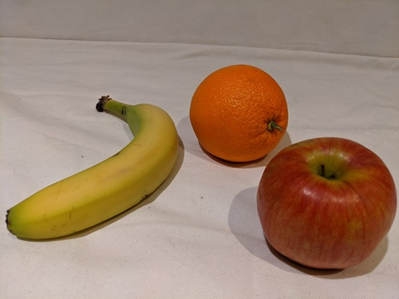

---
lab:
  title: Erkennen von Objekten in Bildern
  description: 'Verwenden Sie den Azure KI Custom Vision-Dienst, um ein Objekterkennungsmodell zu trainieren.'
---

# Erkennen von Objekten in Bildern

Mit dem Dienst **Azure KI Custom Vision** können Sie Modelle für maschinelles Sehen erstellen, die mit Ihren eigenen Bildern trainiert werden. Sie können ihn verwenden, um *Bildklassifizierungs*- und *Objekterkennungs*modelle zu trainieren, die Sie dann veröffentlichen und aus Anwendungen nutzen können.

In dieser Übung verwenden Sie den Custom Vision-Dienst, um ein *Objekterkennungs*modell zu trainieren, das drei Klassen von Obst in einem Bild erkennen und auffinden kann (Apfel, Banane und Orange).

Obwohl diese Übung auf dem Azure Custom Vision-Python-SDK basiert, können Sie KI-Chatanwendungen mit mehreren sprachspezifischen SDKs entwickeln, einschließlich:

* [Azure Custom Vision für JavaScript (Training)](https://www.npmjs.com/package/@azure/cognitiveservices-customvision-training)
* [Azure Custom Vision für JavaScript (Vorhersage)](https://www.npmjs.com/package/@azure/cognitiveservices-customvision-prediction)
* [Azure Custom Vision für Microsoft .NET (Training)](https://www.nuget.org/packages/Microsoft.Azure.CognitiveServices.Vision.CustomVision.Training/)
* [Azure Custom Vision für Microsoft .NET (Vorhersage)](https://www.nuget.org/packages/Microsoft.Azure.CognitiveServices.Vision.CustomVision.Prediction/)
* [Azure Custom Vision für Java (Training)](https://search.maven.org/artifact/com.azure/azure-cognitiveservices-customvision-training/1.1.0-preview.2/jar)
* [Azure Custom Vision für Java (Vorhersage)](https://search.maven.org/artifact/com.azure/azure-cognitiveservices-customvision-prediction/1.1.0-preview.2/jar)

Diese Übung dauert ca. **45** Minuten.

## Erstellen von Custom Vision-Ressourcen

Bevor Sie ein Modell trainieren können, benötigen Sie Azure-Ressourcen für *Training* und *Vorhersage*. Sie können **Custom Vision**-Ressourcen für jede dieser Aufgaben erstellen, oder Sie können eine einzelne Ressource erstellen und sie für beide verwenden. In dieser Übung erstellen Sie **Custom Vision**-Ressourcen für Trainings und Vorhersagen.

1. Öffnen Sie das [Azure-Portal](https://portal.azure.com) unter `https://portal.azure.com`, und melden Sie sich mit Ihren Azure-Anmeldeinformationen an. Schließen Sie alle Willkommensnachrichten oder Tipps, die angezeigt werden.
1. Wählen Sie **Ressource erstellen** aus.
1. Suchen Sie in der Suchleiste nach `Custom Vision`, wählen Sie **Custom Vision** aus und erstellen Sie die Ressource mit den folgenden Einstellungen:
    - **Erstellungsoptionen**: Beide
    - **Abonnement:** *Geben Sie Ihr Azure-Abonnement an.*
    - **Ressourcengruppe**: *Erstellen Sie eine Ressourcengruppe, oder wählen Sie eine Ressourcengruppe aus*.
    - **Region**: *Wählen Sie eine beliebige verfügbare Region aus*.
    - **Name**: *Ein gültiger Name für Ihre Custom Vision-Ressource*
    - **Tarif für Training**: F0
    - **Tarif für Vorhersage**: F0

1. Erstellen Sie die Ressource und warten Sie, bis die Bereitstellung abgeschlossen ist. Zeigen Sie dann die Bereitstellungsdetails an. Beachten Sie, dass zwei Custom Vision-Ressourcen bereitgestellt werden; eine für Trainings und eine andere für die Vorhersage.

    > **Hinweis:** Jede Ressource hat ihren eigenen *Endpunkt* und *Schlüssel*, die verwendet werden, um den Zugriff aus Ihrem Code zu verwalten. Um ein Bildklassifizierungsmodell zu trainieren, muss Ihr Code die *Trainings*ressource (mit ihrem Endpunkt und Schlüssel) verwenden, und um das trainierte Modell zum Vorhersagen von Bildklassen zu verwenden, muss Ihr Code die *Vorhersage*ressource (mit ihrem Endpunkt und Schlüssel) verwenden.

1. Wenn die Ressourcen bereitgestellt wurden, wechseln Sie zur Ressourcengruppe, um sie anzuzeigen. Es sollten zwei Custom Vision-Ressourcen angezeigt werden, eine mit dem Suffix ***-Prediction***.

## Erstellen eines Custom Vision-Projekts im Custom Vision-Portal

Um ein Objekterkennungsmodell zu trainieren, müssen Sie ein Custom Vision-Projekt auf der Grundlage Ihrer Trainingsressource erstellen. Dazu verwenden Sie das Custom Vision-Portal.

1. Öffnen Sie eine neue Browserregisterkarte (schließen Sie die Registerkarte mit dem Azure-Portal nicht, Sie kehren später dorthin zurück).
1. Öffnen Sie auf der neuen Browserregisterkarte das [Custom Vision-Portal](https://customvision.ai) unter `https://customvision.ai`. Wenn Sie dazu aufgefordert werden, melden Sie sich mit Ihren Azure-Anmeldeinformationen an und stimmen Sie den Vertragsbedingungen zu.
1. Erstellen Sie ein neues Projekt mit den folgenden Einstellungen:
    - **Name**: `Detect Fruit`
    - **Beschreibung:** `Object detection for fruit.`
    - **Ressource:** *Ihre Custom Vision-Ressource*
    - **Projekttypen**: Objekterkennung.
    - **Domänen:** Allgemein
1. Warten Sie, bis das Projekt erstellt und im Browser geöffnet wurde.

## Hochladen und Kennzeichnen von Bildern

Nachdem Sie nun über ein Objekterkennungsprojekt verfügen, können Sie Bilder hochladen und taggen, um ein Modell zu trainieren.

### Hochladen und Taggen von Bildern im Custom Vision-Portal

Das Custom Vision-Portal enthält visuelle Tools, mit denen Sie Bilder hochladen und Regionen in diesen taggen können, die mehrere Objekttypen enthalten.

1. Laden Sie auf einer neuen Browserregisterkarte die [Trainingsbilder](https://github.com/MicrosoftLearning/mslearn-ai-vision/raw/main/Labfiles/object-detection/training-images.zip) herunter `https://github.com/MicrosoftLearning/mslearn-ai-vision/raw/main/Labfiles/object-detection/training-images.zip` und extrahieren Sie den ZIP-Ordner, um dessen Inhalt anzuzeigen. Dieser Ordner enthält Bilder von Obst.
1. Wählen Sie im Custom Vision-Portal in Ihrem Objekterkennungsprojekt die Option **Bilder hinzufügen** aus, und laden Sie alle Bilder aus dem extrahierten Ordner hoch.
1. Nachdem die Bilder hochgeladen wurden, wählen Sie das erste Bild aus, um es zu öffnen.
1. Halten Sie den Mauszeiger über ein beliebiges Objekt im Bild, bis ein automatisch erkannter Bereich wie in der folgenden Abbildung angezeigt wird. Wählen Sie dann das Objekt aus, und ändern Sie gegebenenfalls die Größe des Bereichs, um es zu umranden.

    

    Alternativ können Sie auch einfach einen Rahmen um das Objekt herum ziehen, um einen Bereich zu erstellen.

1. Wenn der Bereich das Objekt umgibt, fügen Sie ein neues Tag mit dem entsprechenden Objekttyp (*Apfel*, *Banane* oder *Orange*) hinzu, wie hier gezeigt:

    

1. Wählen Sie jedes andere Objekt im Bild aus und markieren Sie es, indem Sie die Größe der Bereiche ändern und bei Bedarf neue Tags hinzufügen.

    

1. Verwenden Sie den Link **>** auf der rechten Seite, um zum nächsten Bild zu wechseln und dessen Objekte zu markieren. Gehen Sie dann die gesamte Bildersammlung durch und markieren Sie jeden Apfel, jede Banane und jede Orange.

1. Wenn Sie das Tagging des letzten Bildes abgeschlossen haben, schließen Sie den Editor **Bilddetails**. Wählen Sie auf der Seite **Trainingsbilder** unter **Kategorien** die Option **Markiert**, um alle markierten Bilder anzuzeigen:


### Verwenden des Custom Vision SDK zum Hochladen von Bildern

Sie können die Benutzeroberfläche im Custom Vision-Portal nutzen, um Ihre Bilder zu markieren, aber viele KI-Entwicklungsteams verwenden andere Tools, die Dateien generieren, die Informationen über Markierungen und Objektbereiche in Bildern enthalten. In solchen Szenarien können Sie die Custom Vision-Trainings-API verwenden, um markierte Bilder in das Projekt hochzuladen.

1. Klicken Sie auf das Symbol *Einstellungen* (&#9881;) oben rechts auf der Seite **Trainingsbilder** im Custom Vision-Portal, um die Projekteinstellungen anzuzeigen.
1. Notieren Sie unter **Allgemein** (auf der linken Seite) die **Projekt-ID**, die dieses Projekt eindeutig identifiziert.
1. Beachten Sie, dass auf der rechten Seite unter **Ressourcen** der **Schlüssel** und der **Endpunkt** angezeigt werden. Dies sind die Details für die *Trainingsressource*. (Sie können diese Informationen auch abrufen, indem Sie die Ressource im Azure-Portal anzeigen.)
1. Kehren Sie zur Browserregisterkarte mit dem Azure-Portal zurück (schließen Sie die Registerkarte mit dem Custom Vision-Portal nicht, Sie kehren später dorthin zurück).
1. Verwenden Sie im Azure-Portal die Schaltfläche **[\>_]** rechts neben der Suchleiste oben auf der Seite, um eine neue Cloud Shell im Azure-Portal zu erstellen. Wählen Sie eine ***PowerShell***-Umgebung ohne Speicher in Ihrem Abonnement aus.

    Die Cloud Shell bietet eine Befehlszeilenschnittstelle in einem Fenster am unteren Rand des Azure-Portals.

    > **Hinweis**: Wenn Sie zuvor eine Cloud-Shell erstellt haben, die eine *Bash*-Umgebung verwendet, wechseln Sie zu ***PowerShell***.

    > **Hinweis:** Wenn Sie vom Portal aufgefordert werden, einen Speicher auszuwählen, um Ihre Dateien beizubehalten, wählen Sie **Kein Speicherkonto erforderlich** aus. Wählen Sie das verwendete Abonnement aus und drücken Sie auf **Anwenden**.

1. Wählen Sie in der Cloud Shell-Symbolleiste im Menü **Einstellungen** das Menüelement **Zur klassischen Version wechseln** aus (dies ist für die Verwendung des Code-Editors erforderlich).

    **<font color="red">Stellen Sie sicher, dass Sie zur klassischen Version der Cloud Shell gewechselt haben, bevor Sie fortfahren.</font>**

1. Ändern Sie die Größe des Cloud Shell-Bereichs, damit Sie mehr davon anzeigen zu können.

    > **Tipp** Sie können die Größe des Bereichs ändern, indem Sie den oberen Rahmen ziehen. Sie können außerdem die Schaltflächen zum Minimieren und Maximieren verwenden, um zwischen Cloud Shell und der Hauptschnittstelle des Portals zu wechseln.

1. Geben Sie im Cloud Shell-Bereich die folgenden Befehle ein, um das GitHub-Repository mit den Codedateien für diese Übung zu klonen (geben Sie den Befehl ein oder kopieren Sie ihn in die Zwischenablage und klicken Sie dann mit der rechten Maustaste in die Befehlszeile, um ihn als reinen Text einzufügen):

    ```
    rm -r mslearn-ai-vision -f
    git clone https://github.com/MicrosoftLearning/mslearn-ai-vision
    ```

    > **Tipp**: Wenn Sie Befehle in die Cloudshell einfügen, kann die Ausgabe einen großen Teil des Bildschirmpuffers einnehmen. Sie können den Bildschirm löschen, indem Sie den Befehl `cls` eingeben, um sich besser auf die einzelnen Aufgaben konzentrieren zu können.

1. Nachdem das Repository geklont wurde, verwenden Sie den folgenden Befehl, um zu den Anwendungscodedateien zu navigieren:

    ```
   cd mslearn-ai-vision/Labfiles/object-detection/python/train-detector
   ls -a -l
    ```

    Der Ordner enthält Anwendungskonfigurations- und Codedateien für Ihre App. Er enthält auch die Datei **tagged-images.json**, die Begrenzungsrahmenkoordinaten für Objekte in mehreren Bildern und den Unterordner **/images** mit den Bildern enthält.

1. Installieren Sie das Azure KI Custom Vision-SDK-Paket für Trainings und alle anderen erforderlichen Pakete, indem Sie die folgenden Befehle ausführen:

    ```
   python -m venv labenv
   ./labenv/bin/Activate.ps1
   pip install -r requirements.txt azure-cognitiveservices-vision-customvision
    ```

1. Geben Sie den folgenden Befehl ein, um die Konfigurationsdatei für Ihre App zu bearbeiten:

    ```
   code .env
    ```

    Die Datei wird in einem Code-Editor geöffnet.

1. Aktualisieren Sie in der Codedatei die darin enthaltenen Konfigurationswerte so, dass der **Endpunkt** und **Authentifizierungsschlüssel** für Ihre Custom Vision-*Trainingsressource* und die **Projekt-ID** für das zuvor erstellte Custom Vision-Projekt verwendet werden.
1. Nachdem Sie die Platzhalter ersetzt haben, verwenden Sie im Code-Editor den Befehl **STRG+S**, um Ihre Änderungen zu speichern und dann den Befehl **STRG+Q**, um den Code-Editor zu schließen, während die Befehlszeile der Cloud Shell geöffnet bleibt.
1. Geben Sie in der Befehlszeile der Cloud Shell den folgenden Befehl ein, um die Datei **tagged-images.json** zu öffnen und die Tagging-Informationen für die Bilddateien im Unterordner **/images** anzuzeigen:

    ```
   code tagged-images.json
    ```
    
     JSON definiert eine Liste von Bildern, die jeweils einen oder mehrere mit Tag versehene Bereiche enthalten. Jeder markierte Bereich enthält einen Tagnamen sowie die oberen und linken Koordinaten und die Breite und Höhe des Begrenzungsfelds, das das markierte Objekt enthält.

    > **Hinweis**: Die Koordinaten und Dimensionen in dieser Datei geben relative Punkte auf dem Bild an. Ein *Höhen*wert von 0,7 gibt beispielsweise ein Feld an, dessen Höhe 70 % der Höhe des Bilds entspricht. Einige Taggingtools generieren andere Dateiformate, in denen die Koordinaten- und Dimensionswerte Pixel, Zoll oder andere Maßeinheiten darstellen.

1. Schließen Sie die JSON-Datei, ohne Änderungen zu speichern (*CTRL_Q*).

1. Geben Sie in der Befehlszeile der Cloud Shell den folgenden Befehl ein, um die Codedatei für die Clientanwendung zu öffnen:

    ```
   code add-tagged-images.py
    ```

1. Achten Sie auf folgende Details in der Codedatei:
    - Die Namespaces für das Azure KI Custom Vision-SDK werden importiert.
    - Die **Main**-Funktion ruft die Konfigurationseinstellungen ab und verwendet den Schlüssel und Endpunkt, um einen authentifizierten **CustomVisionTrainingClient** zu erstellen, der dann mit der Projekt-ID verwendet wird, um einen **Projekt**verweis auf Ihr Projekt zu erstellen.
    - Die **Upload_Images**-Funktion extrahiert die markierten Bereichsinformationen aus der JSON-Datei und verwendet sie, um einen Batch aus Bildern mit Bereichen zu erstellen, der dann in das Projekt hochgeladen wird.

1. Schließen Sie den Code-Editor (*STRG+Q*) und geben Sie den folgenden Befehl ein, um das Programm auszuführen:

    ```
   python add-tagged-images.py
    ```

1. Warten Sie, bis das Programm beendet wird.
1. Wechseln Sie zurück zur Browserregisterkarte mit dem Custom Vision-Portal (schließen Sie die Registerkarte mit Azure-Portal-Cloud Shell nicht) und zeigen Sie die Seite **Trainingsbilder** für Ihr Projekt an (aktualisieren Sie den Browser bei Bedarf).
1. Vergewissern Sie sich, dass dem Projekt einige neue markierte Bilder hinzugefügt wurden.

## Trainieren und Testen eines Modells

Nachdem Sie nun die Bilder in Ihrem Projekt markiert haben, können Sie ein Modell trainieren.

1. Klicken Sie im Custom Vision-Projekt auf **Trainieren** (&#9881;<sub>&#9881;</sub>), um ein Objekterkennungsmodell anhand der mit Tags versehenen Bilder zu trainieren. Wählen Sie die Option **Quick Training** (Schnelles Training) aus.
1. Warten Sie, bis das Training abgeschlossen ist (es kann in etwa zehn Minuten dauern).

    > **Tipp**: Die Azure Cloud Shell verfügt über ein Inaktivitätszeitlimit von 20 Minuten, nach dem die Sitzung abgebrochen wird. Kehren Sie während Sie auf den Abschluss des Trainings warten von Zeit zu Zeit zur Cloud Shell zurück und geben Sie eine Befehl wie `ls` ein, damit die Sitzung aktiv bleibt.

1. Überprüfen Sie im Custom Vision-Portal nach Abschluss des Trainings die Metriken *Genauigkeit*, *Recall*und *mAP* – diese messen die Vorhersagegenauigkeit des Objekterkennungsmodells und sollten alle hoch sein.
1. Klicken Sie oben rechts auf der Seite auf **Schnelltest** und geben Sie dann im Feld **Bild-URL** `https://aka.ms/test-fruit` ein. Klicken Sie auf die Schaltfläche *Schnelltestbild* (&#10132;).
1. Zeigen Sie die generierte Vorhersage an.

    

1. Schließen Sie das Fenster **Schelltest**.

## Verwenden des Objektdetektors in einer Clientanwendung

Jetzt können Sie Ihr trainiertes Modell veröffentlichen und in einer Clientanwendung verwenden.

### Veröffentlichen des Objekterkennungsmodells

1. Klicken Sie im Custom Vision-Portal auf der Seite **Leistung** auf **&#128504; Veröffentlichen**, um das trainierte Modell mit den folgenden Einstellungen zu veröffentlichen:
    - **Modellname**: `fruit-detector`
    - **Vorhersageressource:** *Dies ist die zuvor erstellte **Vorhersageressource**, die mit „-Prediction“ endet (<u>nicht</u> die Trainingsressource).*
1. Klicken Sie links oben auf der Seite **Projekteinstellungen** auf das Symbol für den *Projektkatalog* (&#128065;), um zur Startseite des Custom Vision-Portals zu gelangen, auf der Ihr Projekt jetzt aufgelistet wird.
1. Klicken Sie auf der Startseite des Custom Vision-Portals oben rechts auf das Symbol *Einstellungen* (&#9881;), um die Einstellungen für Ihren Custom Vision-Dienst anzuzeigen. Suchen Sie dann unter **Ressourcen** Ihre auf „-Prediction“ endende *Vorhersageressource* (<u>nicht</u> die Trainingsressource), um ihre Werte für **Schlüssel** und **Endpunkt** zu ermitteln. (Sie können diese Informationen auch abrufen, indem Sie die Ressource im Azure-Portal anzeigen.)

## Verwenden der Bildklassifizierung aus einer Clientanwendung

Nachdem Sie nun das Bildklassifizierungsmodell veröffentlicht haben, können Sie es aus einer Clientanwendung heraus verwenden. Auch hier können Sie wieder wahlweise **C#** oder **Python** verwenden.

1. Kehren Sie zur Browserregisterkarte zurück, in der sich das Azure-Portal und der Cloud Shell-Bereich befinden.
1. Führen Sie in der Cloud Shell die folgenden Befehle aus, um zum Ordner für Ihre Clientanwendung zu wechseln und die darin enthaltenen Dateien anzuzeigen:

    ```
   cd ../test-detector
   ls -a -l
    ```

    Der Ordner enthält Anwendungskonfigurations- und Codedateien für Ihre App. Sie enthält auch die folgende Bilddatei **produce.jpg**, die Sie zum Testen Ihres Modells verwenden.

    

1. Installieren Sie das Azure KI Custom Vision-SDK-Paket für Vorhersagen und alle anderen erforderlichen Pakete, indem Sie die folgenden Befehle ausführen:

    ```
   python -m venv labenv
   ./labenv/bin/Activate.ps1
   pip install -r requirements.txt azure-cognitiveservices-vision-customvision
    ```

1. Geben Sie den folgenden Befehl ein, um die Konfigurationsdatei für Ihre App zu bearbeiten:

    ```
   code .env
    ```

    Die Datei wird in einem Code-Editor geöffnet.

1. Aktualisieren Sie die Konfigurationswerte so, dass sie den **Endpunkt** und den **Schlüssel** für Ihre Custom Vision-Ressource für die *<u>Vorhersage</u>*, die **Projekt-ID** für das Objekterkennungsprojekt und den Namen Ihres veröffentlichten Modells widerspiegeln (dies sollte *fruit-detector* sein). Speichern Sie Ihre Änderungen (*STRG+S*), und schließen Sie den Code-Editor (*STRG+Q*).

1. Geben Sie in der Befehlszeile der Cloud Shell den folgenden Befehl ein, um die Codedatei für die Clientanwendung zu öffnen:

    ```
   code test-detector.py
    ```

1. Überprüfen Sie den Code und notieren Sie sich die folgenden Details:
    - Die Namespaces für das Azure KI Custom Vision-SDK werden importiert.
    - Die **Main**-Funktion ruft die Konfigurationseinstellungen ab und verwendet den Schlüssel und Endpunkt zum Erstellen eines authentifizierten **CustomVisionPredictionClient**.
    - Das Vorhersageclientobjekt wird verwendet, um Objekterkennungsvorhersagen für das Bild **produce.jpg** zu erhalten, wobei die Projekt-ID und der Modellname in der Anforderung angegeben werden. Die vorhergesagten markierten Bereiche werden dann auf dem Bild gezeichnet, und das Ergebnis wird als **output.jpg** gespeichert.
1. Schließen Sie den Code-Editor und geben Sie den folgenden Befehl ein, um das Programm auszuführen:

    ```
   python test-detector.py
    ```

1. Überprüfen Sie die Programmausgabe, in der jedes im Bild erkannte Objekt aufgeführt wird.
1. Beachten Sie, dass eine Bilddatei mit dem Namen **output.jpg** generiert wird. Verwenden Sie den Befehl **download** (speziell für Azure Cloud Shell), um sie herunterzuladen:

    ```
   download output.jpg
    ```

    Der Downloadbefehl erstellt unten rechts im Browser einen Popuplink, den Sie auswählen können, um die Datei herunterzuladen und zu öffnen. Das Bild sollte in etwa wie folgt aussehen:

    

## Bereinigen von Ressourcen

Wenn Sie die in diesem Lab erstellten Azure-Ressourcen nicht für andere Trainingmodule verwenden, können Sie sie löschen, um weitere Gebühren zu vermeiden.

1. Öffnen Sie das Azure-Portal unter `https://portal.azure.com`, und suchen Sie in der oberen Suchleiste nach den Ressourcen, die Sie in diesem Lab erstellt haben.

1. Wählen Sie auf der Ressourcenseite **Löschen** aus, und folgen Sie den Anweisungen zum Löschen der Ressource. Alternativ können Sie die gesamte Ressourcengruppe löschen, um alle Ressourcen gleichzeitig zu bereinigen.
   
## Weitere Informationen

Weitere Informationen zur Objekterkennung mit dem Custom Vision-Dienst finden Sie in der [Custom Vision Dokumentation](https://docs.microsoft.com/azure/cognitive-services/custom-vision-service/).
